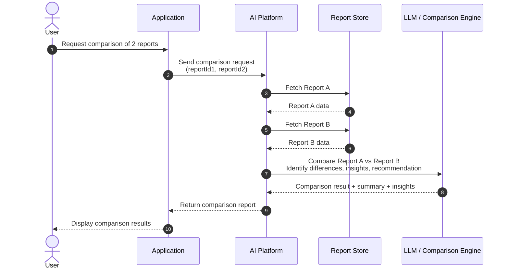

```mermaid
sequenceDiagram
    autonumber

    actor User
    participant App as Application
    participant AI as AI Platform
    participant ReportDB as Report Store
    participant LLM as LLM / Comparison Engine

    User->>App: Request comparison of 2 reports
    App->>AI: Send comparison request<br/>(reportId1, reportId2)

    AI->>ReportDB: Fetch Report A
    ReportDB-->>AI: Report A data

    AI->>ReportDB: Fetch Report B
    ReportDB-->>AI: Report B data

    AI->>LLM: Compare Report A vs Report B<br/>Identify differences, insights, recommendation
    LLM-->>AI: Comparison result + summary + insights

    AI-->>App: Return comparison report
    App-->>User: Display comparison results
```
