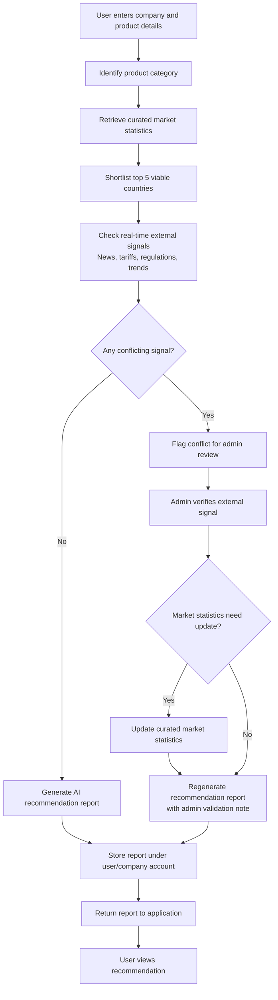

```mermaid
flowchart TD
    A[User enters company and product details] --> B[Identify product category]
    B --> C[Retrieve curated market statistics]
    C --> D[Shortlist top 5 viable countries]
    D --> E[Check real-time external signals<br/>News, tariffs, regulations, trends]
    E --> F{Any conflicting signal?}

    F -- No --> G[Generate AI recommendation report]
    G --> H[Store report under user/company account]
    H --> I[Return report to application]
    I --> J[User views recommendation]

    F -- Yes --> K[Flag conflict for admin review]
    K --> L[Admin verifies external signal]
    L --> M{Market statistics need update?}

    M -- Yes --> N[Update curated market statistics]
    N --> O[Regenerate recommendation report]

    M -- No --> O[Regenerate recommendation report<br/>with admin validation note]

    O --> H
```
