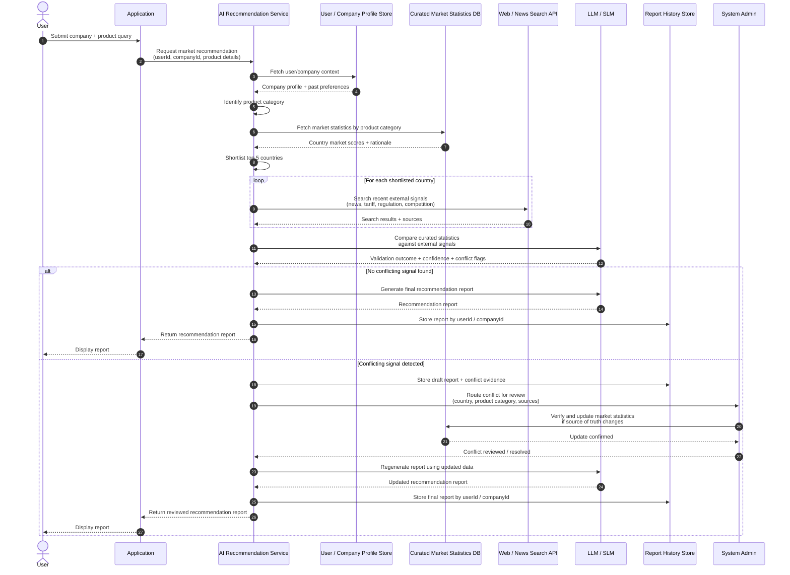

```mermaid
sequenceDiagram
    autonumber

    actor User
    participant App as Application
    participant AI as AI Recommendation Service
    participant Profile as User / Company Profile Store
    participant MarketDB as Curated Market Statistics DB
    participant News as Web / News Search API
    participant LLM as LLM / SLM
    participant ReportDB as Report History Store
    participant Admin as System Admin

    User->>App: Submit company + product query
    App->>AI: Request market recommendation<br/>(userId, companyId, product details)

    AI->>Profile: Fetch user/company context
    Profile-->>AI: Company profile + past preferences

    AI->>AI: Identify product category
    AI->>MarketDB: Fetch market statistics by product category
    MarketDB-->>AI: Country market scores + rationale

    AI->>AI: Shortlist top 5 countries

    loop For each shortlisted country
        AI->>News: Search recent external signals<br/>(news, tariff, regulation, competition)
        News-->>AI: Search results + sources
    end

    AI->>LLM: Compare curated statistics<br/>against external signals
    LLM-->>AI: Validation outcome + confidence + conflict flags

    alt No conflicting signal found
        AI->>LLM: Generate final recommendation report
        LLM-->>AI: Recommendation report
        AI->>ReportDB: Store report by userId / companyId
        AI-->>App: Return recommendation report
        App-->>User: Display report
    else Conflicting signal detected
        AI->>ReportDB: Store draft report + conflict evidence
        AI->>Admin: Route conflict for review<br/>(country, product category, sources)
        Admin->>MarketDB: Verify and update market statistics<br/>if source of truth changes
        MarketDB-->>Admin: Update confirmed
        Admin-->>AI: Conflict reviewed / resolved
        AI->>LLM: Regenerate report using updated data
        LLM-->>AI: Updated recommendation report
        AI->>ReportDB: Store final report by userId / companyId
        AI-->>App: Return reviewed recommendation report
        App-->>User: Display report
    end
```
